# Web-програмування
Курс призначений для того, щоб освоїти елементи навчання для створення сайтів, освоївши базу верстки сайтів, динамічної зміни даних на сайті, роботи бекенду та роботи фреймворку react.js.
Як практичні завдання на даному курсі верстаються сторінки сайтів, сторінки з обчисленнями, односторінковий додаток (one page application) у функціоналі якого реалізовані тести.

У кожному блоці опис виконання завдання (яке достатньо скопіювати і запустити), а також ускладнюючі елементи (для виконання яких необхідно вставити свій контент, змінити параметри або ж реалізувати продемонстровану технологію в нових умовах).
## Робоче місце
Для того, щоб писати Web-програми нам необхідний редактор коду та програма, яка запускатиме ці програми (браузер).
Як редактор коду ми будемо використовувати <a href = "https://code.visualstudio.com/download">Microsoft VS Code</a>, а як браузер будемо використовувати <a href = "https://www. google.com/chrome/">Google Crome</a>.

## Написання тексту та його відображення у браузері

Для роботи створіть папку **work** в корені одного з дисків (краще на диску D, щоб обмеження операційної системи не заважали працювати).


1. Відкрийте створену папку **work** у **MS VS Code**.
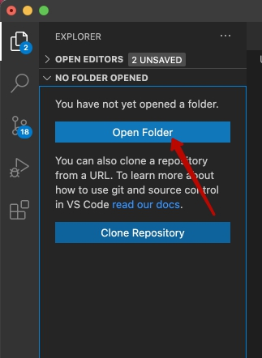  
 
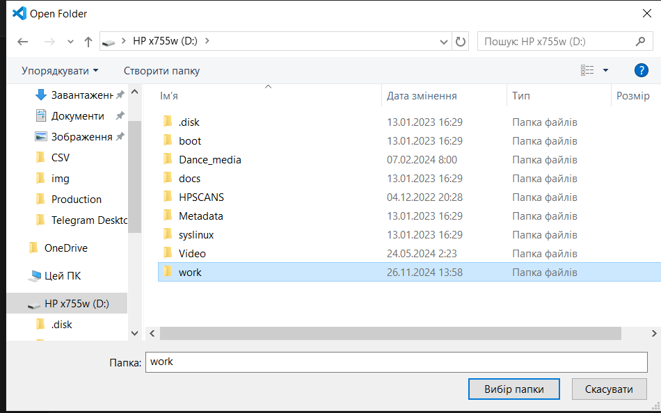  

2. Створимо файл **index.html** (за допомогою кнопки **New File**)  
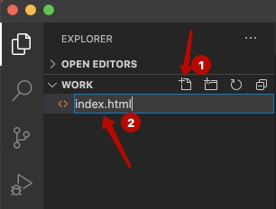  

3. У робочому полі введіть слово "Текст"
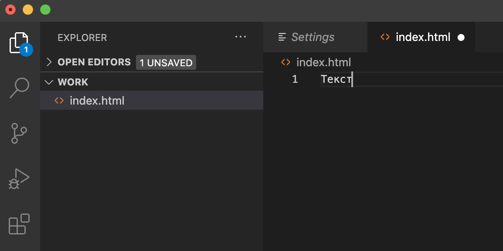  

4. Збережіть файл
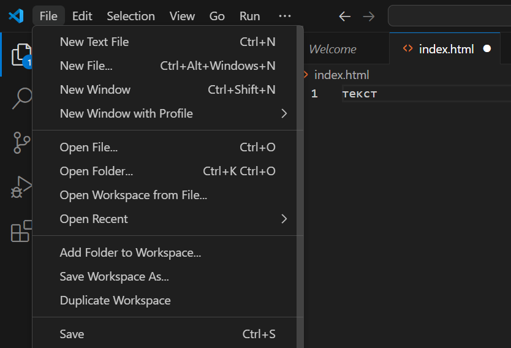  

5. Відкрийте та запустіть файл **index.html** у папці **work**.
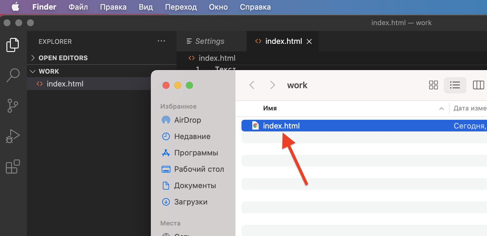  

6. Ви побачите результат:  
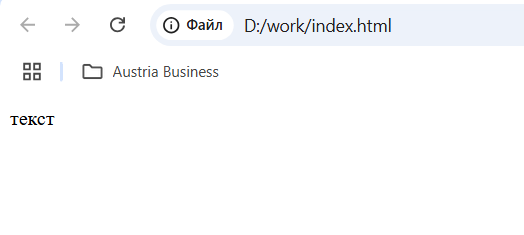  

Найближчим часом ми будемо вводити код у робоче поле редактора MS VS Code, зберігати код та результат бачити у браузері (при кожному новому збереженні оновлюючи сторінку).
## Перші теги
**Теги** (мітки) - дозволяють змінювати зображення тексту. Тег `<b>` робить текст напівжирним, тег `<i>` - написаним курсивом, а тег `<u>` - підкресленим.
Для того, щоб тег змінив нагортання тексту він повинен бути укладений між тегом, що відкривається (`<b>`) і закривається ((`</b>`)).
Напишіть у робочому полі редактора **MS VS Code** наступний текст:

```html
<b>Напівжирний текст</b> <i>Курсивний текст</i> <u>Підкреслений текст</u>
```
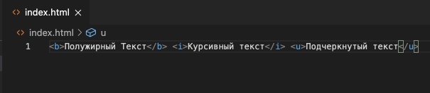   

Збережіть введені теги та відкрийте файл index.html у браузері.
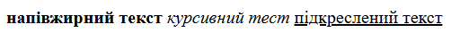  

## Абзац, посилання, малюнок


## Структура HTML-документу

1. У робочому полі введемо символ **!**, а далі, після появи вікна, натисніть **enter**.
  
  

## Task1.

**Оформлення тексту(Новина)**

|№|Альтернативні завдання|Код|Скріншот|
|---|---|---|---|
|1|1. Створіть сторінку з тегами i,b,img,p,a|<a href = "#html">Код сторінки</a>|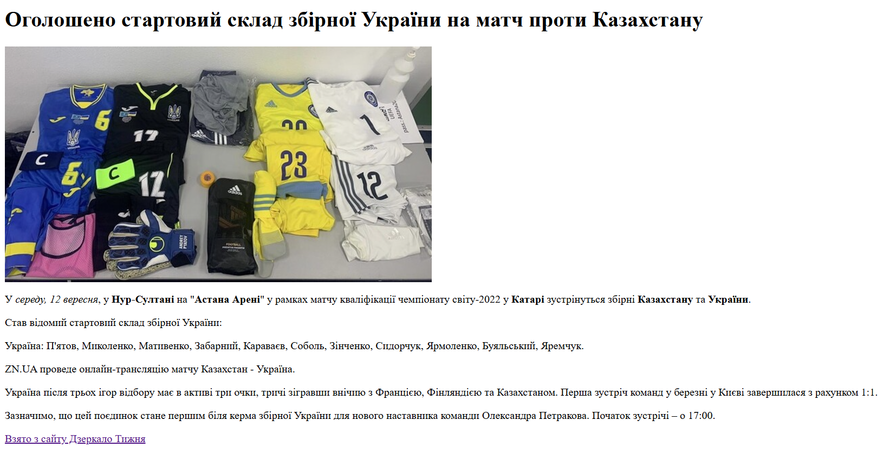|

## HTML
```html
<h1>Оголошено стартовий склад збірної України на матч проти Казахстану</h1>

<p>У <i>середу, 12 вересня</i>, у <b>Нур-Султані</b> на "<b>Астана Арені</b>" у рамках матчу кваліфікації чемпіонату світу-2022
 у <b>Катарі</b> зустрінуться збірні <b>Казахстану</b> та <b>України</b>.</p>

<p>Став відомий стартовий склад збірної України:</p>

<p>Україна: П'ятов, Миколенко, Мативенко, Забарний, Караваєв, Соболь, Зінченко, Сидорчук, Ярмоленко, Буяльський, Яремчук.</p>

<p>ZN.UA проведе онлайн-трансляцію матчу Казахстан - Україна.</p>

<p>Україна після трьох ігор відбору має в активі три очки, тричі зігравши внічию з Францією, Фінляндією та Казахстаном.
 Перша зустріч команд у березні у Києві завершилася з рахунком 1:1.</p>

<p>Зазначимо, що цей поєдинок стане першим біля керма збірної України для нового наставника команди Олександра Петракова.
 Початок зустрічі – о 17:00.</p>
<a href = "https://zn.ua/SPORT/objavlen-startovyj-sostav-sbornoj-ukrainy-na-match-protiv-kazakhstana.html">Взято з сайту Дзеркало Тижня</a>
```

## GitHub.
**Вставка тексту на GitHub Pages**
Створення репозитарію

1. Заходимо на **github.com** (якщо не зареєстровані – зареєструватись)
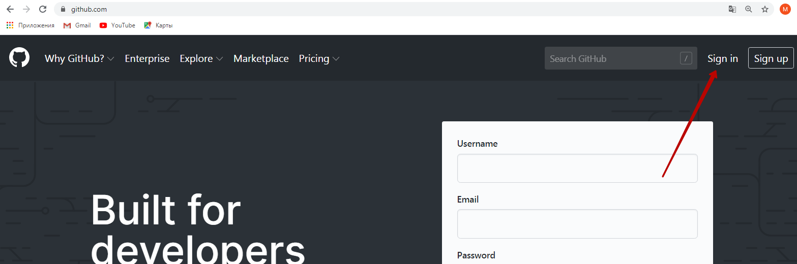
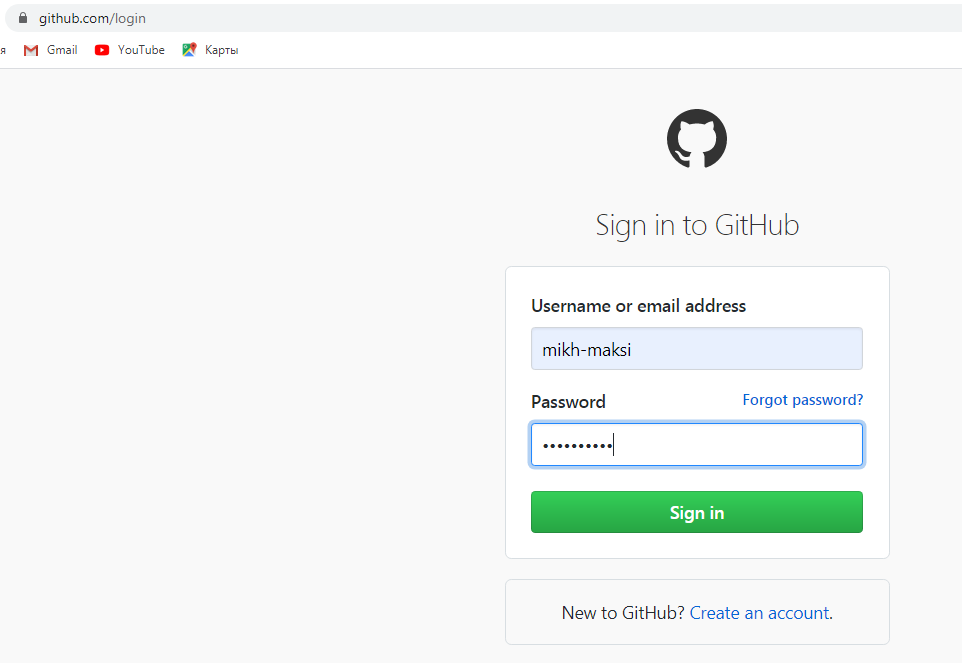

2. Створюємо новий репозитарій
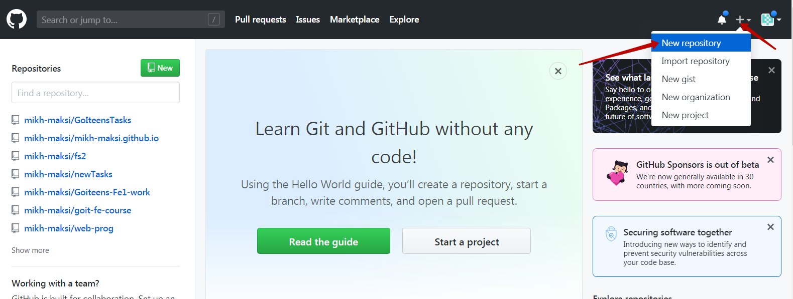

3. Або використовуємо існуючий

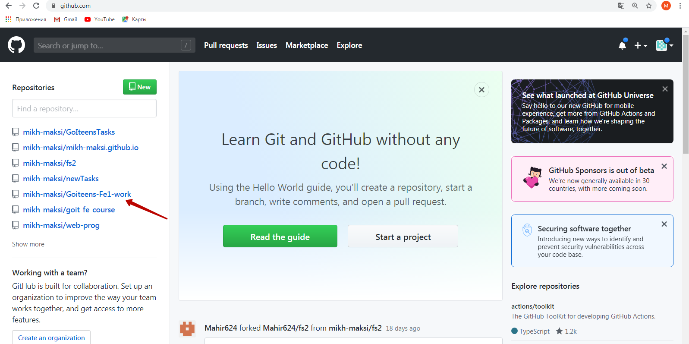

4. Натискаємо кнопку **"clone or download"**

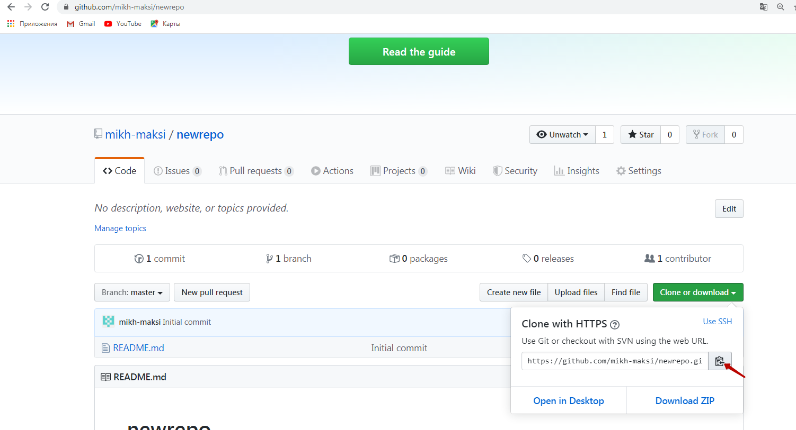

5. Створюємо нову папку і в ній на порожньому місці натискаємо праву клавіші миші, вибираємо **gitBush Here** (якщо програма не встановлена ​​– завантажити: https://git-scm.com/download/ )

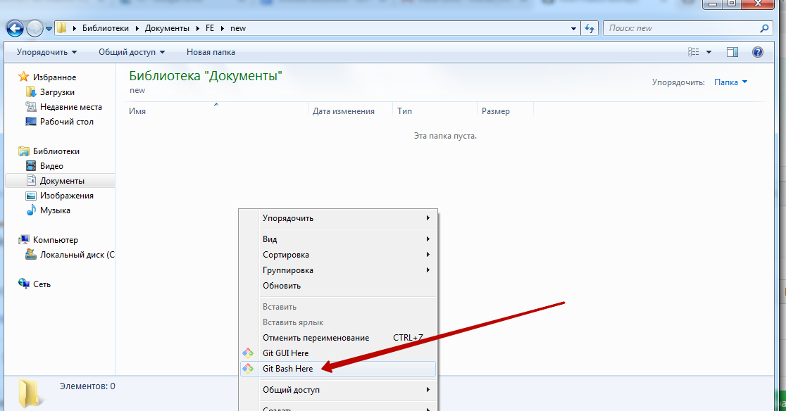

6. У вікні пишемо і натискаємо комбінацію клавіш **Shift+INS**

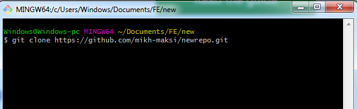

Або натискаємо правою клавішею миші після набраного Вводимо команду **git push** (можливо - потрібно буде вказати логін та пароль до git hub) та вибираємо "Вставити" (Paste)

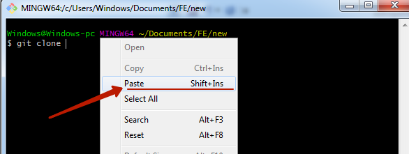

7. Натискаємо **"Enter"**

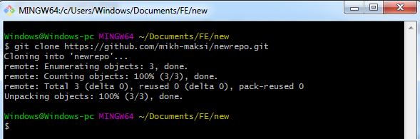

8. Тепер у нашій створеній папці з'явилася нова під папка з назвою такою самою як назва репозитарію (у нашому випадку **newrepo**)
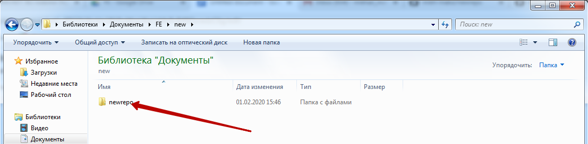

9. Заходимо до папки, створюємо сайт (файли **index.html**, **style.css**, картинки, шрифти, ін.)
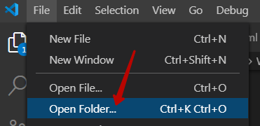
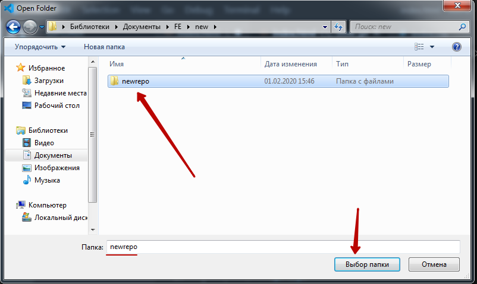

10. Створюємо необхідні файли
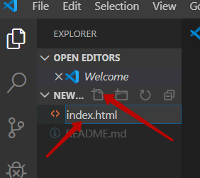
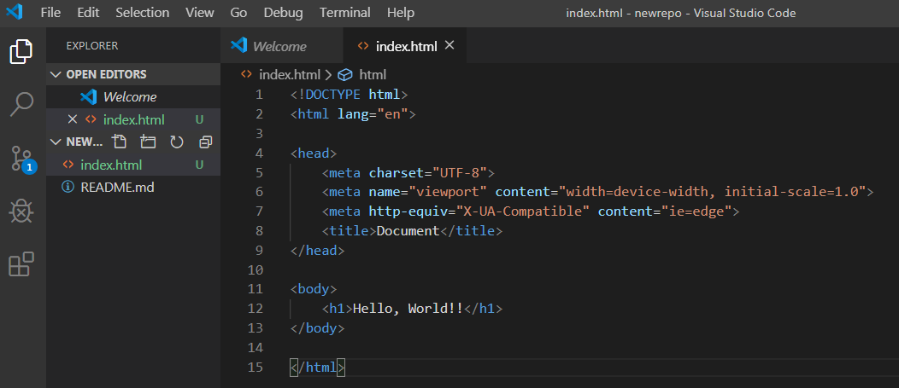
11. Переходимо в провідник і натискаємо правою кнопкою на порожньому місці і вибираємо gitbush Here
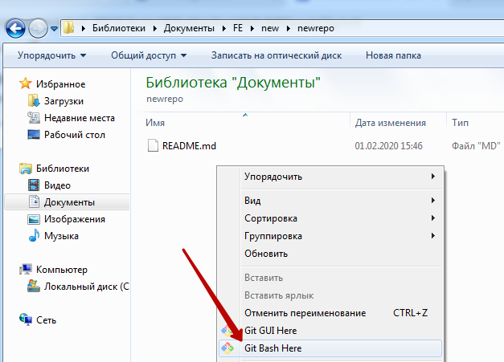


У вікні пишемо **git add .**

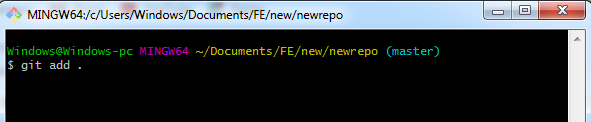

12. Далі – вводимо команду **git commit -m "first commit"**

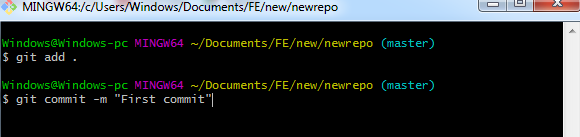

13. Вводимо команду git push (можливо - потрібно буде вказати логін та пароль до git hub)

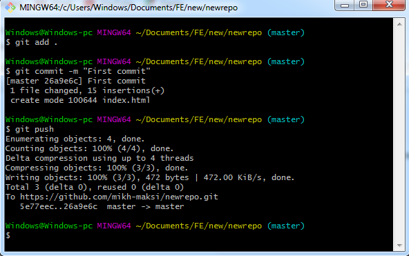

## Task2

**Тематичний сайт (inline-blocks)**

|№|Завдання|Код|Скріншот|
|---|---|---|---|
|2|1. Створіть сайт, використовуючи властивість display:inline-block|<a href="#inline-block">Код сторінки</a>| 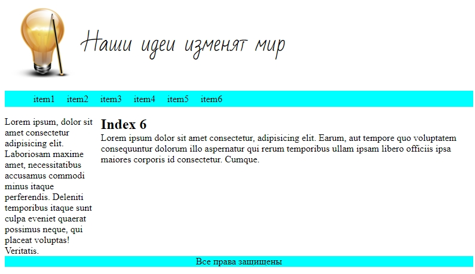|


### inline-block
```html
<!DOCTYPE html>
<html lang="en">
<head>
    <meta charset="UTF-8">
    <meta http-equiv="X-UA-Compatible" content="IE=edge">
    <meta name="viewport" content="width=device-width, initial-scale=1.0">
    <title>Document</title>
    <link rel="stylesheet" href="style2.css">
    <link href="https://fonts.googleapis.com/css?family=Bad+Script" rel="stylesheet">
</head>
<body>
    <div class="wrapper">
        <header>
            <div class="logo"></div>
            <div class="title">Наші ідеї змінять світ</div>
        </header>
        <nav>
            <ul class = "list">
                <li><a href="https://www.google.com/">item1</a></li>
                <li><a href="index2.html">item2</a></li>
                <li><a href="https://karazin.ua/">item3</a></li>
                <li><a href="http://www.cyber.kharkov.ua/">item4</a></li>
                <li><a href="https://city.kharkov.ua/">item5</a></li>
                <li><a href="index6.html">item6</a></li>
            </ul>
        </nav>
        <main>
            <aside class="left">
Lorem ipsum, dolor sit amet consectetur adipisicing elit. Laboriosam maxime amet, necessitatibus accusamus commodi minus itaque perferendis. Deleniti temporibus itaque sunt culpa eveniet quaerat possimus neque, qui placeat voluptas! Veritatis.
            </aside>
            <article class="right">
                <h2>Index 6</h2>
Lorem ipsum dolor sit amet consectetur, adipisicing elit. Earum, aut tempore quo voluptatem consequuntur dolorum illo aspernatur qui rerum temporibus ullam ipsam libero officiis ipsa maiores corporis id consectetur. Cumque.
            </article>
        </main>
        <footer>Усі права захищені</footer>

    </div>
</body>
</html>
```
```css
.logo{
    display: inline-block;
    vertical-align: middle;
    height: 128px;
}
.title{
    display: inline-block;
    vertical-align: middle;
    font-family: 'Bad Script', cursive;
    font-size: 36px;

}
.list{
    background: cyan;
    line-height: 25px;
}
.list li{
    list-style: none;
    display:inline-block;
    text-align:center;

}
.list li a{
    display:inline-block;
    width: 50px;
    text-decoration: none;
    border: 1px solid transparent;
    color:black;
}
.list li a:hover{
    text-decoration: underline;
    border: 1px solid;
}

.left{
    display: inline-block;
    width: 20%;
}
.right{
    vertical-align: top;
    display: inline-block;
    width: calc(80% - 4px);
}
footer{
    text-align: center;
    background: cyan;
}
```

## Flexfroggy
|№|Завдання|Код|Скріншот|
|---|---|---|---|
|3|1. Пройти завдання <a href ="https://flexboxfroggy.com/#ru">FlexFroggy</a><br>2. Пройти завдання <a href ="https://flukeout.github.io/">CSS Diner</a><br>3. Пройти завдання <a href ="http://www.flexboxdefense.com/">FlexBox Defence</a>|---||

## Task4
**Тематический сайт (flexbox)**

|№|Завдання|Код|Скріншот|
|---|---|---|---|
|4|1. Зверстати розклад своєї групи<br>2. Звершити сторінку з фотографіями викладачів своєї кафедри (<a href = "http://www.cyber.kharkov.ua/page-teachers.html">приклад</a>) |<a href = "#Timetable">Код сторінки</a>|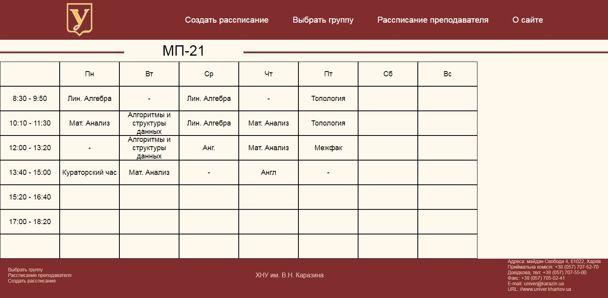|

### Timetable
```html
<!DOCTYPE html>
<html lang="en">
<head>
    <meta charset="UTF-8">
    <meta http-equiv="X-UA-Compatible" content="IE=edge">
    <meta name="viewport" content="width=device-width, initial-scale=1.0">
    <title>Document</title>
    <link rel="stylesheet" href="css/style.css">
</head>
<body>
    <div class="wrapper">
        <header>
            <div class="upper">
                
            <nav class="menu">
                <ul>
                    <li><a href="">Створити розклад</a></li>
                    <li><a href="">Вибрати групу</a></li>
                    <li><a href="">Розклад викладача</a></li>
                    <li><a href="">Про сайт</a></li>                
                </ul>
            </nav>
            </div>
        </header>
        <main>
            <div class="mainup">
                <div class="line"></div>
                <div class="groupname">МП-21</div>
                <div class="line2"></div>
            </div>
            <div class="timetable">
                <div class="s0">
                    <div class="l1"></div>
                    <div class="l2">Пн</div>
                    <div class="l3">Вт</div>
                    <div class="l4">Ср</div>
                    <div class="l5">Чт</div>
                    <div class="l6">Пт</div>
                    <div class="l7">Сб</div>
                    <div class="l8">Нд</div>
                </div>
                <div class="s1">
                    <div class="l1">8:30 - 9:50</div>
                    <div class="l2">Лін. Алгебра</div>
                    <div class="l3">-</div>
                    <div class="l4">Лін. Алгебра</div>
                    <div class="l5">-</div>
                    <div class="l6">Топологія</div>
                    <div class="l7"></div>
                    <div class="l8"></div>
                </div>
                <div class="s2">
                    <div class="l1">10:10 - 11:30</div>
                    <div class="l2 ">Мат. Аналіз</div>
                    <div class="l3">Алгоритми та структури даних</div>
                    <div class="l4">Лін. Алгебра</div>
                    <div class="l5">Мат. Аналіз</div>
                    <div class="l6">Топологія</div>
                    <div class="l7"></div>
                    <div class="l8"></div>
                </div>
                <div class="s3">
                    <div class="l1">12:00 - 13:20</div>
                    <div class="l2">-</div>
                    <div class="l3">Алгоритмы и структуры данных</div>
                    <div class="l4">Анг.</div>
                    <div class="l5">Мат. Анализ</div>
                    <div class="l6">Межфак</div>
                    <div class="l7"></div>
                    <div class="l8"></div>
                </div>
                <div class="s4">
                    <div class="l1">13:40 - 15:00</div>
                    <div class="l2">Кураторский час</div>
                    <div class="l3">Мат. Анализ</div>
                    <div class="l4">-</div>
                    <div class="l5">Англ</div>
                    <div class="l6">-</div>
                    <div class="l7"></div>
                    <div class="l8"></div>
                </div>
                <div class="s5">
                    <div class="l1">15:20 - 16:40</div>
                    <div class="l2"></div>
                    <div class="l3"></div>
                    <div class="l4"></div>
                    <div class="l5"></div>
                    <div class="l6"></div>
                    <div class="l7"></div>
                    <div class="l8"></div>
                </div>
                <div class="s6">
                    <div class="l1">17:00 - 18:20</div>
                    <div class="l2"></div>
                    <div class="l3"></div>
                    <div class="l4"></div>
                    <div class="l5"></div>
                    <div class="l6"></div>
                    <div class="l7"></div>
                    <div class="l8"></div>
                </div>
                <div class="s7">
                    <div class="l1"></div>
                    <div class="l2"></div>
                    <div class="l3"></div>
                    <div class="l4"></div>
                    <div class="l5"></div>
                    <div class="l6"></div>
                    <div class="l7"></div>
                    <div class="l8"></div>
                </div>
            </div>
        </main>
        <footer>
            <div class="down">
                <div class="fm1">
                    <nav>
                        <ul>
                            <li><a href="">Вибрати групу</a></li>
                            <li><a href="">Розклад викладача</a></li>
                            <li><a href="">Створити розклад</a></li>                        
                        </ul>
                    </nav>
                    
                </div>
                    <div class="fm2">ХНУ им. В.Н.  Каразина</div>
                    <div class="fm3">Адреса: майдан Свободи 4, 61022, Харків<br>
                    Приймальна комісія: +38 (057) 707-52-70<br>
                    Довідкова, тел: +38 (057) 707-55-00<br>
                    Факс: +38 (057) 705-02-41<br>
                    E-mail: univer@karazin.ua<br>
                    URL: //www.univer.kharkov.ua</div>
                    </div>        </footer>
    </div>
</body>
</html>
```

```css
*{
    margin:0;
    padding:0;
}
body{
    background: url('../img/pixel.png');
}
.wrapper{
    display: flex;
    flex-direction: column;
}
header{
    height:100px;
    background-color: #822d2d;
}
footer{
    height:100px;
    background-color: #822d2d;    
}
.upper{
    width:1200px;
    margin: 0 auto;
    height: 100%;
    display: flex;
    justify-content: space-between;
    align-items: center;
}
.menu ul{
    display: flex;
    width:900px;
    justify-content: space-between;
    align-items: center ;
}
.menu ul li{
    list-style: none;
}
.menu ul li a{
    color:white;
    font-size:21px;
    font-family: Arial;
    text-decoration: none;
}
.menu ul li a:hover{
    text-decoration: underline;
}
.mainup{
    display: flex;
}
.line, .line2{
    height: 55px;
    background: url('../img/line.png');
}
.line{
    width:calc(40% - 300px);
}
.line2{
    width:60%;
}
.groupname{
    display: flex;
    justify-content: center;
    align-items: center;
    width:300px;
    text-align: center;
    font-family: Arial, Helvetica, sans-serif;
    font-size:36px;
    background: url('../img/pixel.png');
}
.main div{
    border: 1px solid;
}

.timetable{
    width: 1200px;
}

.timetable div{
    display: flex;
}
.timetable div div{
    height:60px;
    width:150px;
    display: flex;
    justify-content: center;
    align-items: center;
    font-family: Arial;
    font-size: 18px;
    border: 1px solid;
    text-align: center;
}

.down{
    display: flex;
    justify-content: space-between;
    color:#e4c4b5;
    font-family: Arial, Helvetica, sans-serif;
    font-size: 12px;
    padding-left: 20px;
    padding-right: 20px;
}
.down ul li{
    list-style: none;
}
.down a{
    justify-content: space-between;
    color:#e4c4b5;
    font-family: Arial, Helvetica, sans-serif;
    text-decoration: none;
}
.down a:hover{
    text-decoration: underline;
}
.down div{
    display: flex;
    justify-content: center;
    align-items: center;
}

.fm2{
    font-size: 16px;
}
```
## Task5
**Калькулятор**

|№|Завдання|Код|Скріншот|
|---|---|---|---|
|5|1. Реалізуйте розрахунковий калькулятор <br> 2. Додайте до калькулятора основи теорії<br> 3. Реалізуйте в калькуляторі значення за замовчуванням (за допомогою placeholder)<br>4. Додайте 5 умов задач, які вирішуються за допомогою калькулятора |<a href = "#Calculator">Код сторінки</a>| |

### Calculator
```html
<!DOCTYPE html>
<html lang="en">
<head>
    <meta charset="UTF-8">
    <meta name="viewport" content="width=device-width, initial-scale=1.0">
    <title>Calculator</title>
    <link rel="preconnect" href="https://fonts.gstatic.com">
    <link href="https://fonts.googleapis.com/css2?family=Fascinate&display=swap" rel="stylesheet">
    <link rel="stylesheet" href="style.css">
</head>
<body>


   <div class="container">
        <h2 class="title"> Розв'язання задачі з мікроекономіки </h2>
        <h3 class="task"> Визначте ВВП, обчислений виробничим методом, якщо:
        ринкова вартість випущеної продукції - <b>P</b>; поточні матеріальні витрати - <b>М</b>; амортизаційні
        відрахування - <b>А</b>; непрямі податки на товари та послуги - <b>Н</b>; державні субсидії
        на їхнє виробництво - <b>С</b>.</h3>
       <div class="task-content">
       <h3> P:</h3><input id="p" value="" autocomplete="off">
       <h3> M:</h3><input id="m" value="" autocomplete="off">
       <h3> A:</h3><input id="a" value="" autocomplete="off">
       <h3> H:</h3><input id="n" value="" autocomplete="off">
       <h3> C:</h3><input id="c" value="" autocomplete="off">
      </div>
          <div class="task-text">
<h3 class="formula">
 ВВП = ΣВДС + Н - С, де
 ΣВДС - сума валової доданої вартості в основних цінах всіх секторів або
 галузей економіки;
 </h3>
 <h3> Додана вартість – це валова продукція підприємства (або ринкова ціна)
 випущеної продукції) за мінусом поточних матеріальних витрат, але з включенням до
 її відрахувань на амортизацію (оскільки основні фонди підприємства приймають
 участь у створенні нової вартості продукції, що виробляється). </h3>          <h3> ВВП:</h3> <p id="res"></p></div>
       <div class="button">
           <button id="btn"> click </button>
       </div>


   </div>
<script src="js.js"></script>
</body>
</html>
```
CSS
```css
* {
    box-sizing: border-box;
}
body {
    font-family: 'Fascinate', cursive;
}
.container {
    width: 1200px;
    margin: 0 auto;
    background: azure;
    box-shadow: 0 0 10px rgba(0,0,0,0.5);
}
.task-content h3 {
    margin: 5px;
}
h3,h2, button{
    text-align: center;
}
.task-content, .task-text, .button {
    text-align: center;
}
input {
    font-size: 17px;
    text-align: center;
    padding: 10px;
    height: 25px;
    width: 300px;
}
.task-text {
    margin: 0 35px;
}
button {
    cursor: pointer;
    width: 200px;
    margin-bottom: 20px;
}
p {
    font-size: 25px;
    margin: 15px 0;
}

```
JS
```js
btn.addEventListener("click",f_out);

   function f_out (){
       q = Number(p.value) - Number(m.value) + Number(a.value) + Number(n.value) - Number(c.value);
       res.innerHTML = q;
   }
```
<p class="codepen" data-height="300" data-default-tab="html,result" data-slug-hash="jOGEbzo" data-user="mikh-maksi" style="height: 300px; box-sizing: border-box; display: flex; align-items: center; justify-content: center; border: 2px solid; margin: 1em 0; padding: 1em;">
  <span>See the Pen <a href="https://codepen.io/mikh-maksi/pen/jOGEbzo">
  Untitled</a> by Mikhail (<a href="https://codepen.io/mikh-maksi">@mikh-maksi</a>)
  on <a href="https://codepen.io">CodePen</a>.</span>
</p>
<script async src="https://cpwebassets.codepen.io/assets/embed/ei.js"></script>

## Task6
**Відповідь на 1 питання**

|№|Завдання|Код|Скріншот|
|---|---|---|---|
|6|1. Створіть тест із 4 варіантом відповіді, при правильній відповіді на запитання видається повідомлення. <br> 2. Реалізуйте варіант тесту з текстом. 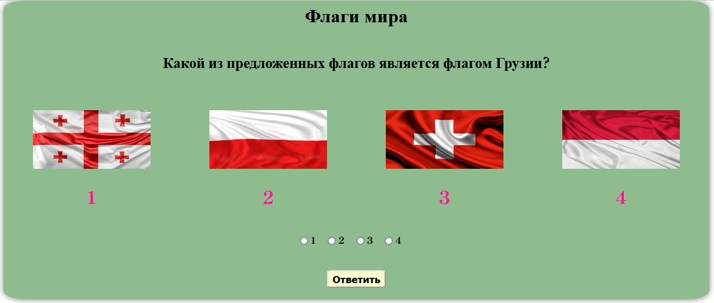|
### qiuz
**HTML**
```html
<!doctype html>
<html lang="en">
<head>
    <meta charset="UTF-8">
    <meta name="viewport"
          content="width=device-width, user-scalable=no, initial-scale=1.0, maximum-scale=1.0, minimum-scale=1.0">
    <meta http-equiv="X-UA-Compatible" content="ie=edge">
    <title>Document</title>
    <link rel="preconnect" href="https://fonts.gstatic.com">
    <link href="https://fonts.googleapis.com/css2?family=Shippori+Mincho:wght@800&display=swap" rel="stylesheet">
    <link rel="stylesheet" href="style.css">
</head>
<body>
<div class="container">
 <h1 class="title"> Флаги світу </h1>

 <h3 class="quest"> Який із запропонованих прапорів є прапором Грузії?</h3>
 <div class="img">
 <div class="item">
 
 <p> 1 </p>
 </div>
 <div class="item">
 
 <p> 2 </p>
 </div>
 <div class="item">
 
 <p> 3 </p>
 </div>
 <div class="item">
 
 <p> 4 </p>
 </div>
 </div>
<div class="input-style">
 <p> <input type="radio" name="color" id="f1" > 1</p>
 <p> <input type="radio" name="color" id="f2" > 2 </p>
 <p> <input type="radio" name="color" id="f3" > 3 </p>
 <p> <input type="radio" name="color" id="f4" > 4 ​​</p>
</div>
 <button id = "btn" class="answ"> Відповідати </button>

 <div class="right_answ">
 <p class="right hdn" id="right">Правильний відповідь</p>
 </div>

 <div class="wrong hdn" id="wrong">
 <div class="wrong-content">
 <p class="wrong1" id="wrong1">Неправильний відповідь</p>
 </div>

 <button class="answ2" id = "btn1">Переглянути відповідь</button>
 </div>
 <p class="correct hdn" id="answer" > 1 </p>
</div>
<script src="js.js"></script>

</body>
</html>
```
**CSS**
```css
* {
    box-sizing: border-box;
    margin: 0;
    padding: 0;
   text-align: center;
   margin-bottom: 20px;
}
.container {
    font-family: 'Shippori Mincho', serif;
    width: 1200px;
    border-radius: 3%;
    margin: 0 auto;
    box-shadow: 0 0 10px rgba(0,0,0,0.5);
    background: darkseagreen;
}
h3 {
    font-size: 25px;
    padding-bottom: 45px;
}
.title {
    text-align: center;
    padding-bottom: 20px;
}

.img {
    display: flex;
    justify-content: space-around;
    margin: 0;
}
img {
    width: 200px;
    height: 100px;
}
.item p {
    font-size: 30px;
    color: deeppink;
}
input {
    margin: 0;
}
.input-style {
    justify-content: center;
    display: flex;
}
.input-style p {
    margin-right: 20px;
}
.answ, .answ2 {

    font-size: 17px;
    cursor: pointer;
    background: lemonchiffon;
    border-radius: 10%;
    font-weight: bold;
    height: 30px;
}
.answ {
    width: 100px;
}
.answ2 {
    width: 180px;
    margin: 0;
}
.right{
    background-color: rgba(0, 200, 0, 0.5);
}
.wrong1 {
     background-color: rgb(255, 44, 55);
 }
.right_answ,
.wrong-content {
    display: flex;
    justify-content: center;
    margin: 0;
}
.right,
.wrong1{
    padding-bottom: 5px;
    font-size: 20px;
    width: 300px;
    align-content: center;
    border-radius: 5px;
}

.hdn{
padding-bottom: 20px;
font-size: 22px;
display: none;
}

.opend{
background-color: skyblue;
}
.correct {
    font-size: 20px;
    padding-bottom: 20px;
    margin-top: -17px;
}
```
```js
btn.addEventListener("click", f_out);
btn1.addEventListener("click", f_out1);
function f_out (){
    console.log(f1.checked);
    console.log(f2.checked);
    console.log(f3.checked);
    console.log(f4.checked);

    if (f1.checked){
        right.classList.remove("hdn");
        wrong.classList.add("hdn");
        alert("Სწორი პასუხი (Відповідь вірна!)");
    }else{
        right.classList.add("hdn");
        wrong.classList.remove("hdn");
        alert("მეტი იფიქრე (подумайте ще!)");
    }

}
function f_out1 (){
    answer.classList.toggle("hdn");
    btn1.classList.toggle("opend");
}

```
    

## Task7

**Відповідь на кілька питань**

|№|Завдання|Код|Скріншот|
|---|---|---|---|
|7|1. Створіть тест із 5 питань з використанням масиву |<a href = "#ArrayQuiz">Код сторінки</a>|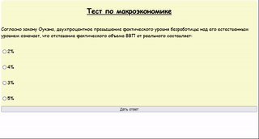|
### ArrayQuiz
```html
<!DOCTYPE html>
<html lang="en">
<head>
    <meta charset="UTF-8">
    <meta http-equiv="X-UA-Compatible" content="IE=edge">
    <meta name="viewport" content="width=device-width, initial-scale=1.0">
    <title>Document</title>
    <link rel="stylesheet" href="style.css">
    <link rel="preconnect" href="https://fonts.gstatic.com">
    <link href="https://fonts.googleapis.com/css2?family=Balsamiq+Sans:ital@1&display=swap" rel="stylesheet">
</head>
<body>
    <div class="wrapper">
        <h2 class="header">Тест з макроекономіки</h2>
        <p id="question"></p>
        <p><input type="radio" name="variant" id="y1"><span  id = "a1"></span></p>
        <p><input type="radio" name="variant" id="y2"><span  id = "a2"></span></p>
        <p><input type="radio" name="variant" id="y3"><span  id = "a3"></span></p>
        <p><input type="radio" name="variant" id="y4"><span  id = "a4"></span></p>

<button id = "btn">Відповісти</button>
 <div class="right_div hidden" id = "right_div">
 <p class="right" id="right">Правильна відповідь</p>
 <button id = "btn2">Наступне питання</button>
 </div>
 <div class="wrong_div hidden" id="wrong_div">
 <p class="wrong" id="wrong">Неправильна відповідь</p>
 <button id = "btn1">Подивитися відповідь</button>
 <p id="answer" class = "hidden"></p>
 </div>

    
    </div>
    <input type="hidden" value = "0" id = "n_question">
    
    <script src="js.js"></script>
</body>
</html>
```
```css
.wrapper{
    margin:0 auto;
    width:900px;
    display: flex;
    flex-direction: column;
    font-family: 'Balsamiq Sans', cursive;
    font-family: 'Train One', cursive;
    background-color: lightgoldenrodyellow;
    border-radius: 10px;
}
.header{
    text-decoration: underline;
    text-align: center;
}
.right{
    background-color: rgba(0, 200, 0, 0.5);
    border-radius: 5px;
    padding-left:5px;
}
.wrong{
    background-color: rgb(255, 44, 55);
    border-radius: 5px;
    padding-left:5px;
}
.hidden{
    display: none;
}
#btn1{
    background-color: -internal-light-dark(rgb(239, 239, 239), rgb(59, 59, 59));
}
.opend{
    background-color: skyblue;
}
```

```js
let question_arr = ["Згідно із законом Оукена, двовідсоткове перевищення фактичного рівня безробіття над його природним рівнем означає, що відставання фактичного обсягу ВВП від реального становить:","Інфляція витрат розвивається при:","Крива, що показує зв'язок між рівнем безробіття та річним темпом , зростання цін - це:","Державний борг-це:","Фіскальна політика може бути:"]
let a1_arr = ["2%", "помірному зростанні обсягів грошової маси", "крива Лоренца", "заборгованість населення, фірм, банків та зарубіжних держав перед урядом цієї країни", "стимулюючої"]
let a2_arr = ["4%","зростанні цін на ресурси","крива Лаффера","заборгованість уряду перед населенням країни","стримує"]
let a3_arr = ["3%","зростанні цін на споживчі товари та послуги","крива Філіпса","заборгованість уряду цієї країни перед іноземними державами","автоматичної"]
let a4_arr = ["5%","зниженні облікової ставки","крива попиту","заборгованість уряду перед усіма господарюючими суб'єктами як цієї країни, так і зарубіжних країн","всі відповіді вірні"]
let answer_arr = ["5%","зростання цін на ресурси","крива Філіпса","заборгованість уряду перед усіма господарюючими суб'єктами як цієї країни, так і зарубіжних країн","всі відповіді вірні"]
let n_right_answer_arr = [4,2,3,4,4]
let n_right_answer = 1;
let right_answers = 0;
let n_answer = 4;

question.innerHTML=question_arr[n_question.value];
a1.innerHTML = a1_arr[n_question.value];
a2.innerHTML = a2_arr[n_question.value];
a3.innerHTML = a3_arr[n_question.value];
a4.innerHTML = a4_arr[n_question.value];
answer.innerHTML = answer_arr[n_question.value];

n_right_answer = n_right_answer_arr[n_question.value];
console.log(n_question.value)
btn.addEventListener("click", f_out);
btn1.addEventListener("click", f_out1);
btn2.addEventListener("click", f_out2);
  function f_out (){
        console.log(y1.checked);
        console.log(y2.checked);
        console.log(y3.checked);
        console.log(y4.checked);

        if (y1.checked){ n_a = 1;}
        if (y2.checked){ n_a = 2;}
        if (y3.checked){ n_a = 3;}
        if (y4.checked){ n_a = 4;}
        console.log(n_a);
        
        if (n_a == n_right_answer){
        right_answers += 1;
        right_div.classList.remove("hidden");
        wrong_div.classList.add("hidden");
        console.log("n_question.value = "+n_question.value);
        console.log("n_answer = "+n_answer);
        if (n_question.value == n_answer){
            btn2.classList.add("hidden");
            let el1 = document.createElement("p");
            el1.innerHTML = "<b>"+right_answers+"</b>";
            right_div.appendChild(el1);
        }
        }
        else{
        right_answers-=1;
        right_div.classList.add("hidden");
        wrong_div.classList.remove("hidden");
        }
  }
  function f_out1 (){
    answer.classList.toggle("hidden");
    btn1.classList.toggle("opend");
  }
  function f_out2 (){
    right_div.classList.add("hidden");
    k = Number(n_question.value);
    k+=1;
    n_question.value = k;
    console.log(n_question)
    question.innerHTML=question_arr[n_question.value];
    a1.innerHTML = a1_arr[n_question.value];
    a2.innerHTML = a2_arr[n_question.value];
    a3.innerHTML = a3_arr[n_question.value];
    a4.innerHTML = a4_arr[n_question.value];
    answer.innerHTML = answer_arr[n_question.value];
    
    n_right_answer =n_right_answer_arr[n_question.value];
    
  }
```
## Task8

**Отримання для питань даних із сервера**

|№|Завдання|Код|Скріншот|
|---|---|---|---|
|8|1. Запрограмуйте квіз, який отримує дані з сервера|<a href = "#JSONQuiz">Код сторінки</a>|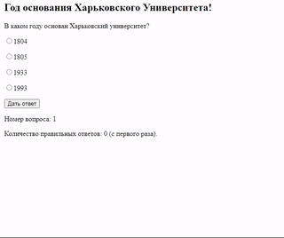|

### JSONQuiz

```html
<!DOCTYPE html>
<html lang="en">
<head>
    <meta charset="UTF-8">
    <meta name="viewport" content="width=device-width, initial-scale=1.0">
    <title>Document</title>
    <link rel="stylesheet" href="css/style.css">
</head>
<body>
    <div class="wrapper" id="wrapper">
        <div id="questions">
        <h2 id = "title"></h2>
        <p id  = "question"></p>
        <p><input type="radio" name="year" id="y1"><span  id = "a1"></span></p>
        <p><input type="radio" name="year" id="y2"><span  id = "a2"></span></p>
        <p><input type="radio" name="year" id="y3"><span  id = "a3"></span></p>
        <p><input type="radio" name="year" id="y4"><span  id = "a4"></span></p>

<button id = "get_answer">Відповісти</button>
 <div class="right_div hidden" id = "right_div">
 <p class="right" id="right">Правильна відповідь</p>
 <button id = "next_question">Наступне питання</button>
 </div>
 <div class="wrong_div hidden" id="wrong_div">
 <p class="wrong" id="wrong">Неправильна відповідь</p>
 <button id = "view_answer">Подивитися відповідь</button>
 </div>

 <p id="answer" class = "hidden"></p>
 </div>
 <div id="total_div">
 <p>Номер питання: <span id="n"></span></p>
 <p>Кількість правильних відповідей: <span id="n_right"></span> (з першого разу).</p>
 </div>
 </div>

    
    <input type="hidden" value = "0" id = "n_question">
    <script src="js/js.js"></script>
</body>
</html>
```

```css
.wrapper{
    margin:0 auto;
    width:600px;
    display: flex;
    flex-direction: column;
}
.right{
    background-color: rgba(0, 200, 0, 0.5);
    border-radius: 5px;
    padding-left:5px;
}
.wrong{
    background-color: rgb(255, 44, 55);
    border-radius: 5px;
    padding-left:5px;
}
.hidden{
    display: none;
}
#btn1{
    background-color: -internal-light-dark(rgb(239, 239, 239), rgb(59, 59, 59));
}
.opend{
    background-color: skyblue;
}
```

```js
right_answer_n = 0;

k = Number(n_question.value);
console.log(k);
n.innerHTML=k+1;
n_right.innerHTML=right_answer_n;
point = 1;

answers(n_question.value);

get_answer.addEventListener("click", f_get_answer);
view_answer.addEventListener("click", f_view_answer);
next_question.addEventListener("click", f_next_question);

  function f_get_answer (){

    if (y1.checked){ n_a = 1;}
    if (y2.checked){ n_a = 2;}
    if (y3.checked){ n_a = 3;}
    if (y4.checked){ n_a = 4;}

    if (n_a == n_right_answer){
      right_div.classList.remove("hidden");
      wrong_div.classList.add("hidden");
      right_answer_n = right_answer_n +point;
      point = 0;
    }else{
      right_div.classList.add("hidden");
      wrong_div.classList.remove("hidden");
      point = 0;
    }
   
  }
  function f_view_answer (){
    answer.classList.toggle("hidden");
    view_answer.classList.toggle("opend");
  }
  function f_next_question (){
    if (k<Number(n_question.value)-1){
    console.log(k,Number(n_question.value));
    right_div.classList.add("hidden");
    answer.classList.add("hidden");
    point = 1;
    k+=1;
    n_right.innerHTML=right_answer_n;
    n.innerHTML=k+1;
    answers(k);
    }else{
      n_right.innerHTML=right_answer_n;
      questions.classList.add("hidden");

    }
  }

function answers(k){
  query = 'https://innovations.kh.ua/quiz/list/?author_id=0&n='+k;
  console.log(query);
  fetch(query).then(response => response.json())
  .then(function (quiz) {
    question.innerHTML=quiz.question_arr[0];
    title.innerHTML = quiz.title_arr[0];
    a1.innerHTML = quiz.a1_arr[0];
    a2.innerHTML = quiz.a2_arr[0];
    a3.innerHTML = quiz.a3_arr[0];
    a4.innerHTML = quiz.a4_arr[0];
    answer.innerHTML = quiz.answer_arr[0];
    
    n_right_answer = quiz.n_right_answer_arr[0];
    n_question.value = quiz.total_n;
    console.log(quiz);
      
  });
}
```

## DataBase

**Наполнение БД (MySQL)**
1. Перейшовши за посиланням в СУБД <a href = "https://phpmyadmin.adm.tools/signon.php?user=levelhst_quiz&password=xx2V%29H7%2B4e&account=levelhst">PhpMyAdmin</a>
2. Створіть запис про свою групу в таблиці **groups** (якщо такого запису ще немає)
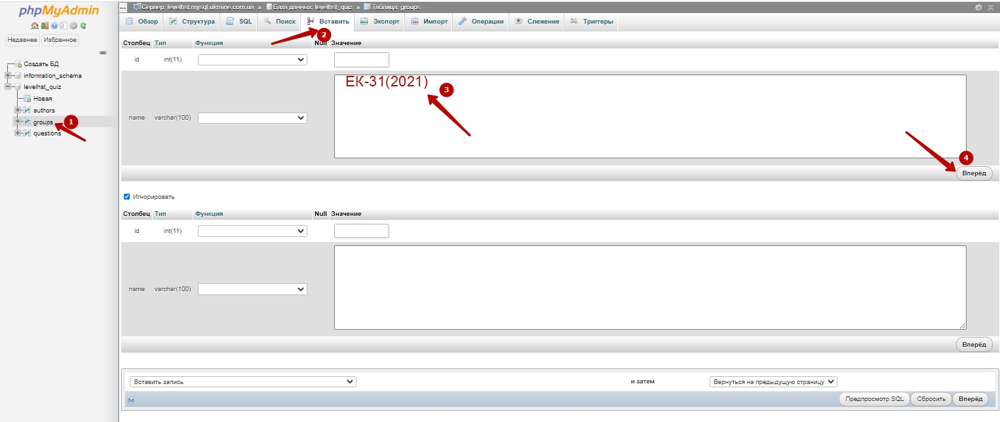
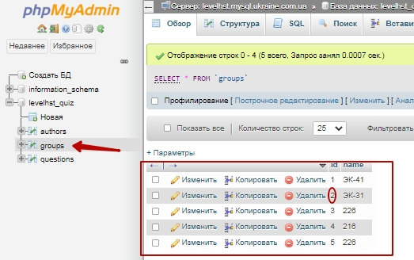

3. Створіть запис себе у таблиці **authors** (і запам'ятайте id такого запису).
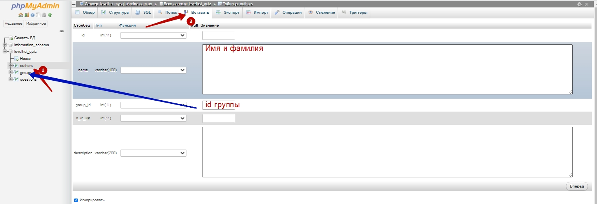
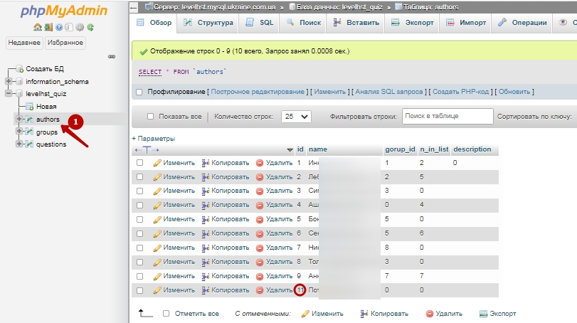

4. Створіть записи питань у таблиці **questions**
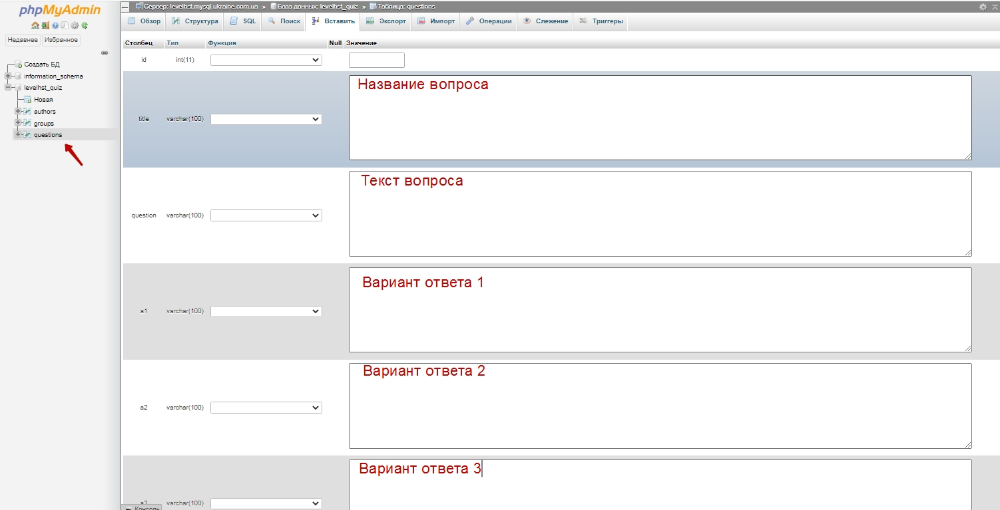
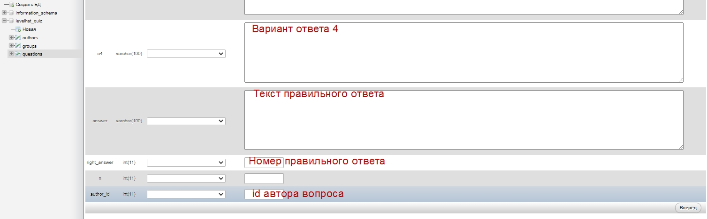

## Task9
**React.js**


|№|Завдання|Код|Скріншот|
|---|---|---|---|
|9|1. Створіть програму на React.js|<a href = "https://github.com/mikh-maksi/karazin-fe/tree/main/simple-way#react">Код сторінки</a>| |
### react
#### Установка
1. Встановити https://nodejs.org/en/
2. npm install create-react-app -g
3. create-react-app --version (перевіряємо версію)
4. create-react-app name
5. cd name
6. npm start

```js
import React from "react";

class App extends React.Component{
  render(){
    return (
      <div>
        <div>Hello</div>
      </div>
    );
  }
}

export default App;

```

#### Создаем компоненты
##### Создадим компонент info
1. У папці `src` створюємо папку `components`
2. У папці `components` створюємо файл `info.js`
``js
import React від "react";

class Info extends React.Component{
 render(){
 return(
 <div>
 <h2>Інформаційний заголовок</h2>
 <p>Інформація</p>
 </div>
 );
 }
}
````
export default Info;

у файлі `app.js` імпортуємо файл `info.js`:

У заголовку пишемо:
```js
import Info from "./components/info"
````
у **render** ставимо

`<Info />` у місці, де необхідно виводити дані відповідного компонента.


## Створимо компонент form

1. У папці `components` створимо файл `form.js`
2. У створеному файлі розмістимо наступний текст:

```js
import React від "react";

class Form extends React.Component{
 render(){
 return(
 <div>
 <h2>компонент з формою</h2>
 <p>Інформація</p>
 </div>
 );
 }
}

export default Form;

```


#### Створимо компонент Weather

#### Створимо компонент Підключимо компоненти до головного компонента


```
<form />
<info />
<Weather />
```

#### Виведемо результати fetch - запиту
```js
    const api_url = await
    fetch(`http://api.openweathermap.org/data/2.5/weather?q=Kharkiv,ua&appid=58c3cca0622442647544fb302144ba06&units=metric`);
    const data =await api_url.json();

```

#### Введемо код у компонент Form
```js
import React from "react";

class Form extends React.Component{
    render(){
        return(
            <form onSubmit={this.props.weatherMethod}>
                <input type = "text" name="city" placeholder="Місто" />
                <button>Отримати погоду</button>
            </form>

        );
    }
}

export default Form;
```

