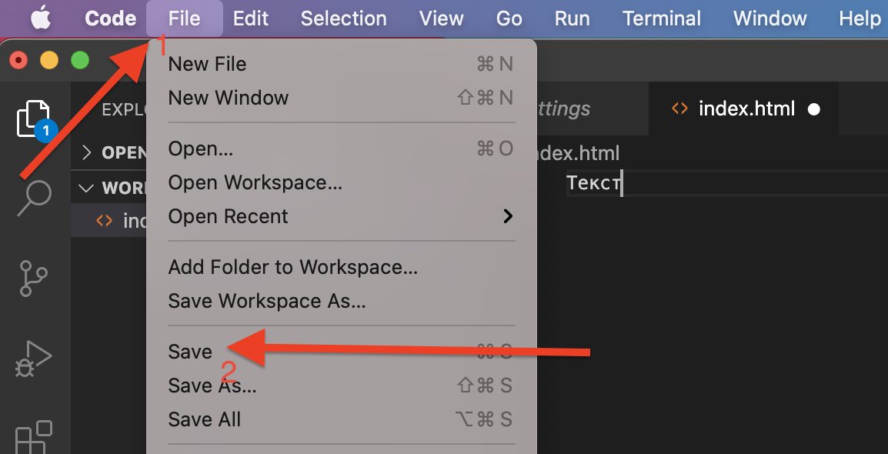

# FrontEnd
**Суть курса:** освоить технологии **FrontEnd** - разработки (верстка в технологиях HTML+CSS), программирование на языке JavaScript, а также познакомиться со связью BackEnd (PHP) и MySQL.

## Рабочее место
Для того: чтобы писать Web-программы нам необходим редактор кода и программа, которая будет запускать эти программы (браузер).  
В качестве редактора кода мы будем использовать <a href = "https://code.visualstudio.com/download">Microsoft VS Code</a>, а в качестве браузера будем использовать <a href = "https://www.google.com/chrome/">Google Crome</a>.  
  
## Написание текста и его отображение в браузере

Для работы создайте папку **work** в корне одного из дисков (лучше на диске D, чтобы ограничения операционной системы не мешали работать).


1. Откройте созданную папку **work** в **MS VS Code**.  
  
 
  

2. Создадим файл **index.html** (с помощью кнопки **New File**)  
  

3. В рабочем поле введите слово "Текст"
  

4. Сохраните файл
  

5. Откройте и запустите файл **index.html** в папке **work**.
  

6. Вы увидите результат:
  

В ближашее время мы будем вводить код в рабочее поле редактора MS VS Code, сохранять код и результат видеть в браузере (при каждом новом сохранении обновляя страницу).

## Первые теги
**Теги** (метки) - позволяют изменять начертание текста. Тег `<b>` делает текст полужирным, тег `<i>` - написанным курсивом, а тег `<u>` - подчеркнутым.  
Для того, чтобы тег изменил наертание текста он должен быть заключен между открывающимся (`<b>`) и закрывающимся ((`</b>`)) тегом.  
Напишите в рабочем поле редактора **MS VS Code** следующий текст:
 
```html
<b>Полужирный Текст</b> <i>Курсивный текст</i> <u>Подчеркнутый текст</u>
```

   

Сохраните введенные теги и откройте файл index.html в браузере.  
  

## Абзац, ссылка, картинка


## Структура HTML-документа

1. В рабочем поле введем символ **!**, а далее, после появления выпадающего окна, нажмите **enter**.
  
  